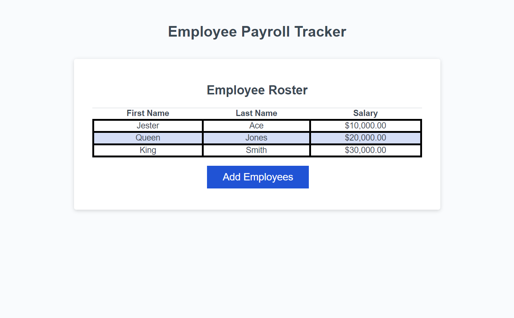

# Employee Payroll Tracker

## Overview
The Employee Payroll Tracker is a web application designed to manage and display payroll information for employees. It features a clean interface with a table view of employee data and functionality to add new employee records.

## Features
- **Dynamic Employee Table**: Displays a list of employees along with their salary details.
- **Add Employee Functionality**: Provides a button to add new employees to the payroll list.
- **Responsive Design**: Adapted for different screen sizes with appropriate styling.

## Technologies Used
- HTML5
- CSS3
- JavaScript

## Setup
To run this project locally:
1. Clone the repository.
2. Open `index.html` in your browser.

## Screenshots

## Future Enhancements
- Implementation of form modal for entering new employee details.
- Integration with a backend database for storing employee records.
- Adding edit and delete data for employee records.
